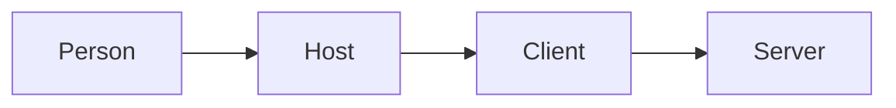
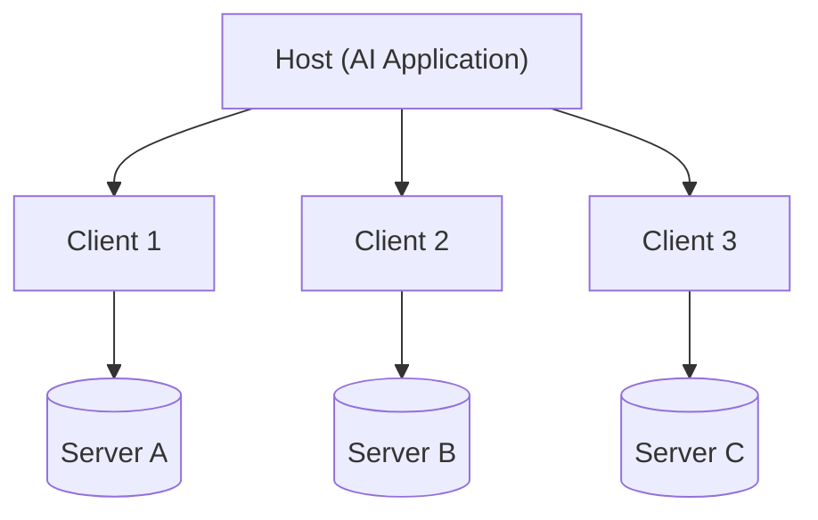
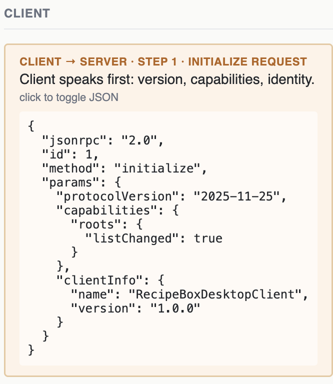
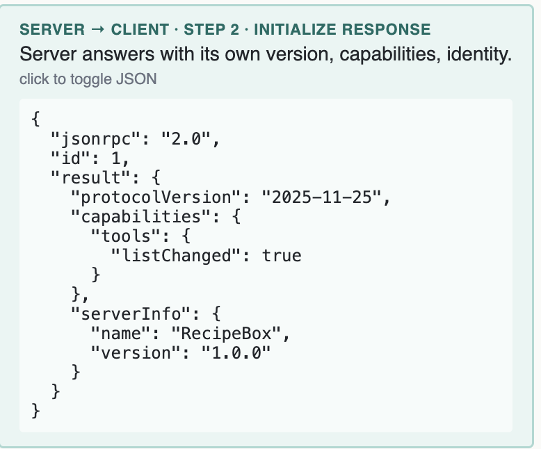
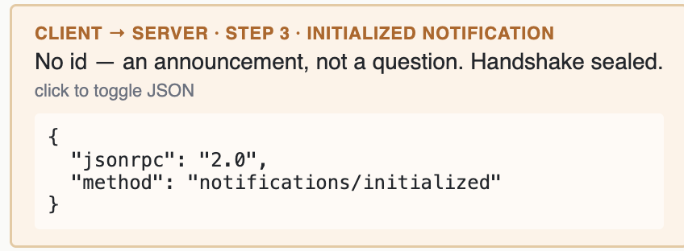
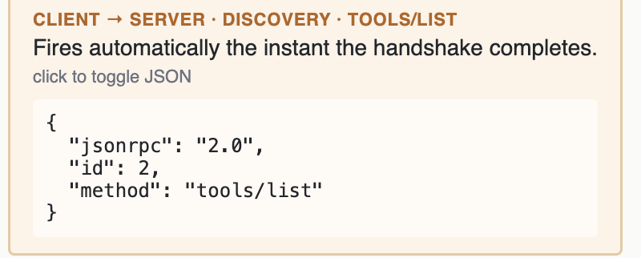
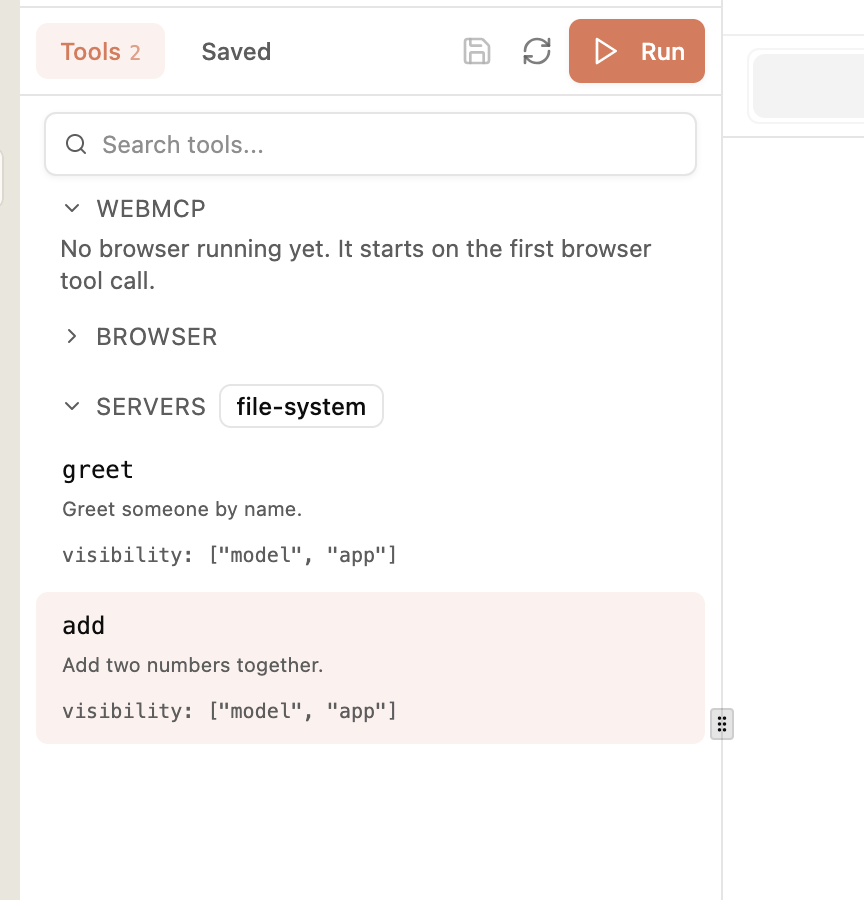
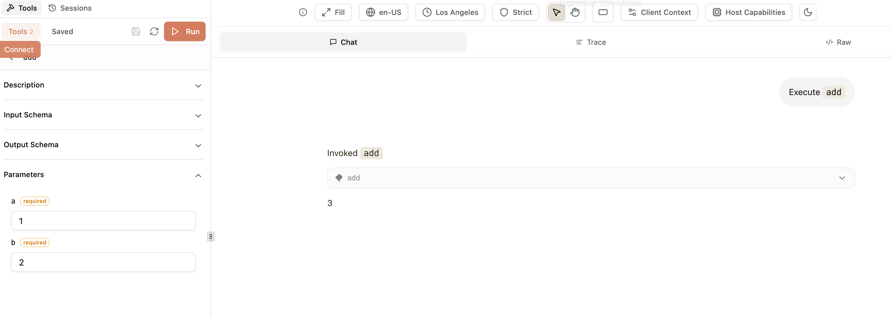
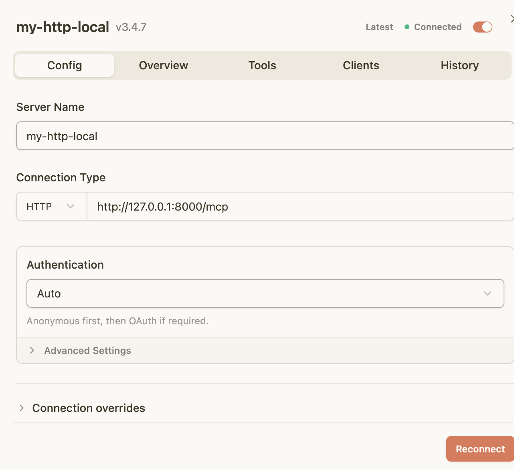

# Krish naik AgenticAI 3.0 Notes

## MCP (Model context protocol)
MCP was developed by anthropic. MCP is an opensource standard for connecting AI applications to external systems. In the begining everyone had to create custom tools that can perform operations they wanted to do example to read email, write email etc. But with MCP, email provider like gmail will provide an MCP server that contains access to all tools, and other required items such as prompt and resources. This helps model to connect as a client to those MCP servers. We can this way connect to any MCP server that we need. 
MCP server is a collection of tools which we access to perform actions. 
In claudeai connectors we see are MCP servers basically provided by different companies. 

With MCP, a developer builds one MCP server for their tool (like GitHub, Google Drive, or a local database), and any AI model that supports MCP can instantly use it.

Advantages of MCP
* Easy to define and access
* scalable - any number of users can connect to mcp
* No redundant code
* Access to all tools and applications - every application will want to create mcp servers to support more user base. 
* Less prone to failure

Negatives of MCP
* complex to set up
* many servers run locally
* less idea about implementation (inside the mcp server is blackbox)

MCP is just a shared toolbox — a standard-shaped collection of tools and APIs that any AI model can reach into, instead of every developer building their own private toolbox from scratch. Tools are what you can order. Resources are the reservation book you're allowed to check. Prompts are the pre-written specials card suggesting what to order - three different kinds of help, from one restaurant.


* Claude desktop, cursor etc is the HOST that runs the MCP client. It knows MCP protocol. 
* MCP Client calls MCP Server over STDIO or Streamable HTTP option. 
* Server calls the real API
* Result flow all the way back to the client 


When the claude desktop starts up it sends initialization message to each connector it is set up to connect to. In MCP world, there is a single host used with multiple clients to connect to multiple connector. 


For example, host is like mobile phone, client is like sim card, and connection to Jio needs one sim card, connection to airtel needs another sim card, but for all of them, they use same host. This is the underlying idea. So claude desktop uses single host to connect to all the connectors. This helps with decoupling individual connections , safety, parallelism and scalability in connections. 


Transport layer: client and server speak JSON-RPC 2.0, not plain REST. Two transport types — STDIO for local servers, Streamable HTTP for remote/hosted servers

**More notes from Mayank**

<a href="https://github.com/mayank953/Live-Class-2026/blob/main/classes_summary/16%20-%2023%20Aug%20-%20MCP%20Introduction.md" target="_blank">MCP-Host-Client-Server</a>


MCP Server contains tools, resources, prompts.

### MCP Client
HOST never connect to server directly. They use client that talks to the server. Host and Server speak the same language. 
* user ask host for send an email 
* host send this request to client
* client makes a structured request to server. They use JSON-RPC for this
* server responds with structured response
* For each MCP server, host will spin off a seperate client

This 1:1 relationship between client and server has benefits.
* scalability of clients and servers 
* security impact is minimal to individual connection
* each connection can have its own authentication mechanism
* client and server conversations can happen in parallel

### MCP Primitives

<a href="https://modelcontextprotocol.io/docs/2026-07-28/learn/server-concepts">MCP concepts documentation</a>
It explains all things a server can offer.
* **tools** - action which AI can ask server to perform (Eg: send email using gmail mcp server)
* **resources** - data sources AI can read (normally static data - Host can read this data at the begining giving host understanding of what mcp server is offering - Eg: github readme, for db server it may be schema details documentation )
* **predefined prompts** - predefined prompt template helps AI to work better

### Functions of the primitive

* MCP tools primitive has the ability to list and call tools. This helps MCP host to know what tools are available. 

| **MCP Operation** | **Purpose**              | **Returns**                            |
| ----------------- | ------------------------ | -------------------------------------- |
| **`tools/list`**  | Discover available tools | Array of tool definitions with schemas |
| **`tools/call`**  | Execute a specific tool  | Tool execution result                  |

* Resource provide static data. 

| **Method**         | **Purpose**                | **Returns**                           |
| ------------------ | -------------------------- | ------------------------------------- |
| **`resources/list`**           | List available direct resources | Array of resource descriptors          |
| **`resources/templates/list`** | Discover resource templates     | Array of resource template definitions |
| **`resources/read`**           | Retrieve resource contents      | Resource data with metadata            |
| **`subscriptions/listen`**     | Monitor resource changes        | Stream of update notifications         |

* Prompts has list and get. 

| **Method**         | **Purpose**                | **Returns**                           |
| ------------------ | -------------------------- | ------------------------------------- |
| **`prompts/list`** | Discover available prompts | Array of prompt descriptors           |
| **`prompts/get`**  | Retrieve prompt details    | Full prompt definition with arguments |


### MCP Lifecycle

* initialization \
when connection is initialized for first time 
* operation \
what operations can be performed, call tools, read resources etc
* shutdown \
where connetion is closed

**Why JSON-RPC?**
* Lightweight — plain JSON, human-readable at a glance
* Transport-agnostic — same shape over stdio or HTTP
* Two-way by design — either side can send a request
* Notifications built in — no id, fires and expects nothing back
* RPC because this allows us to call the function in a remote machine as if its a local function

MCP uses JSON-RPC 2.0 for the message format and RPC semantics, while HTTP (specifically Streamable HTTP) can be one of the transports that carries those messages.

MCP needs standardized concepts such as:

| Need                                  | JSON-RPC provides                         |
| ------------------------------------- | ----------------------------------------- |
| Request → response matching           | `id`                                      |
| Identify operation                    | `method`                                  |
| Pass arguments                        | `params`                                  |
| Standard errors                       | `error`                                   |
| Notifications                         | Messages without `id`                     |
| Bidirectional RPC-style communication | Request/response + notifications          |
| Transport independence                | Same protocol can work over stdio or HTTP |


MCP uses JSON-RPC because MCP needs a standardized, transport-independent RPC message protocol. HTTP is a transport; JSON-RPC defines how MCP requests, responses, errors, and notifications are structured. MCP can therefore run over stdio or Streamable HTTP without changing the MCP message semantics.


#### Initialization

** Structure ** 
<a href="https://mcp-lifecycle.netlify.app/">mcp lifecycle docs from mayank</a>
<a href="https://modelcontextprotocol.io/specification/2025-11-25/basic/lifecycle">mcp lifecycle docs</a>

* Step 1 -
A sample request structure from client to server using json rpc 2.0


* Step 2 -
Response from server to client

The id value in response from server matches with the request from client. 
The id helps to link the response to a specific request. protocolversion has to be compatible between client and server. 

* Step 3 -
Client responds back with initialized notification. 


As client sends new request for additional calls, id value is incremeneted.
After this, they are connected for the whole session. 

| Field | Meaning |
|---|---|
| `jsonrpc` | Always `"2.0"` — identifies the JSON-RPC version |
| `id` | Identifies a request so its response/error can be matched to it |
| `method` | The operation being requested |
| `params` | Arguments supplied to the method |
| `result` | Successful response returned for a request |
| `error` | Error response returned when a request fails |


In this connection is not open, once client send request it forgets it. Server sends back another request (which is a response of request from client) to provide update. 


** Version negotiation in handshake** 

* client sends it version(latest supported)
* server sends back its version(latest supported)
* if client supports it, it moves forward, otherwise it disconnects. 


**interview question**

if you want your MCP client to work with an MCP server that was built 2 years ago, the main thing is protocol-version negotiation and backward compatibility. MCP clients ensure compatibility with older servers through protocol-version negotiation during initialization and by checking the server’s advertised capabilities.

If the server supports an older MCP version, the client uses that mutually supported version and only uses features/capabilities that the server actually supports.

**Capability negotiation in handshake** 

Capability negotiation helps to confirm what both sides can do. capabilities are added under "request" or "result" from client and server respectively. 


**In latest MCP, lifecycle is deprecated and not used**

#### Operation
During the operation phase, the client and server exchange messages according to the negotiated capabilities.
Both parties MUST:
Respect the negotiated protocol version
Only use capabilities that were successfully negotiated

**Discovery**
Discovery fires automatically the instant the handshake completes — before the user even asks a question.

In discovery tools primitive will call tools/list. The server responds back with description about the tool. After this only the actual tool call from the client side. 


**Calling**
In this phase actual tool call happens with tools/call and passing the arguments. 


#### Shutdown
"Shutdown has no goodbye message of its own. The transport closing IS the goodbye."
| Transport           | Client shutdown                                                                        | Server shutdown                                                 |
| ------------------- | -------------------------------------------------------------------------------------- | --------------------------------------------------------------- |
| **stdio**           | Close `stdin`, wait; send `SIGTERM` if it doesn't exit; use `SIGKILL` as a last resort | Server closes its output stream and exits                       |
| **Streamable HTTP** | Close the HTTP connection                                                              | Server closes unexpectedly — client should reconnect gracefully |

**<u>Transport layer connection types</u>**

shutdown depends on the type of connection made between client and server. 

**if mcp server is running locally** \
Stdio process - client connects with server running in same machine through stdio process. Example terminal running python program where terminal is client and poython program is server they talk trhough stdio to take input and get output. If they are running on same machine just close the stdio connection is enough to shutdown. Usually in this case server is running in local machine where Host and Client exist. 
* fast connection - since both running on same system 
* secure - since both running on same system 
* simple
In STDIO, No JSON-RPC message is exchanged during shutdown at all. The entire responsibility shifts to the transport layer.

**if mcp server is running remote** \
Streamable http - client talks to server over http protocol using post request. client can close connection. The url is ending in /mcp. 
see this setup has local and remote connections. \


**How to create MCP Server and run it locally**

MCP servers can be created and run in local. 
```
uv init mcp-warmup
uv add fastmcp
uv run python mcp_with_primitives.py
```
mcp_with_primitives.py is below
```
# Assemble the complete, final server and write it to disk

from fastmcp import FastMCP

mcp = FastMCP("Warm-Up Server")

@mcp.tool
def greet(name: str) -> str:
    """Greet someone by name."""
    return f"Hello, {name}! Welcome to MCP."

@mcp.resource("file://server-notes")
def server_notes() -> str:
    """Read-only notes about this server, straight from a local file."""
    with open("server-notes.txt") as f:
        return f.read()

@mcp.tool
def add(a: int, b: int) -> int:
    """Add two numbers together."""
    return a + b

@mcp.prompt
def structured_escalation(issue_summary: str, what_was_tried: str, customer_sentiment: str) -> str:
    """Guides the AI to log a customer escalation with every required field, in order."""
    return f"""Log this customer escalation with the following structure:
Issue Summary: {issue_summary}
What Was Already Tried: {what_was_tried}
Customer Sentiment: {customer_sentiment}
Recommended Next Action: [determine this from the details above]
"""

if __name__ == "__main__":
    mcp.run()

**accessing through inspector**
```
You can access this  through a interactive inspector UI provided by an external open-source package published by Anthropic called @modelcontextprotocol/inspector. 

```
npx -y @modelcontextprotocol/inspector uv run python mcp_with_primitives.py
opened as
http://127.0.0.1:6274/?MCP_INSPECTOR_API_TOKEN=405f2544b819e21dac9800e0047057ffeed0401e737dc923fe748b6af9185512

```

When you run npx @modelcontextprotocol/inspector, npm downloads a single, pre-bundled package from the global npm registry. Inside this package is a Vite + React + Mantine single-page web application. The Local Proxy Server: When you run the npx command, it spins up a tiny local Node.js backend proxy server on your machine (typically listening on http://localhost:6274). [1] (https://mcp.so/servers/inspector)

**using mcpjam to test your local mcpserver**

You can start up mcpjam server in your local which can provide a UI using which you can test other mcp servers like the one we set up in our local. A different port to ensure it does not compete for the same 6274 port. 
```
npx @mcpjam/inspector@latest --port 4000
```

**connect as STDIO to your local mcp server**

In this case you dont start your local mcp server example. You invoke it through MCPJAM as a subprocess. 
Now you can connect to the custom fastmcp server you created using the MCPJAM tool 
by adding the server through Add Server option. Choose STDIO for MCPJAM to start your
FASTMCP server as a seperate subprocess. You dont have to run fastmcp locally while running mcpjam. MCPJam will connect to your FASTMCP and invoke it as if its a child process or a simple python file. 

```
uv --directory <folder where python file is present> run python mcp_with_primitives.py

```





**connect as Streamable HTTP to your local mcp server**

In this case you need to start your mcp server example as HTTP process so that it has a localhost HTTP url with which it can be access.
Below command is run in the folder where your mcp server code is present. It will give you a URL like   http://127.0.0.1:8000/mcp   
```
uv run fastmcp run mcp_with_primitives.py --transport http --port 8000

```
Using the above URL you can connect from MCPJAM now. 



**mcp libraries**
**mcp library**
* from official Claude/Anthropic
* In this version using mcp library you have to write more low level code where you have to define on your own list_tools and call_tools method and define your tools in there manually. 
<a href="https://github.com/mayank953/Live-Class-2026/blob/main/Complete%20MCP/first-mcp-server/recipebox_lowlevel.py">Low level code for recipebox example</a>
```
pip install mcp
```
**fastmcp library** 
* with this library you just define your tools alone using @mcp.tool decorator. You dont define list or call tools method yourself. 
```
pip install fastmcp
```
Both options give you MCP Inspector. 
Start code in mcp inspector using below
```
CLIENT_PORT=6280 npx @modelcontextprotocol/inspector python3 mcp_with_primitives.py
```
**Adding MCPServer in Claude desktop**

To add this MCP server as a connector to claude desktop run the below comman.d
```
uv run  fastmcp install claude-desktop recipebox_fastmcp.py
```
You can see this connector when you open claude desktop. If you want to remove it, 
go to terminal and run nano ~/Library/Application\ Support/Claude/claude_desktop_config.json
Edit the file and remove the specific server added under mcpservers file. 
CNTRL + 0 and CNTRL+X to save and exit. 
