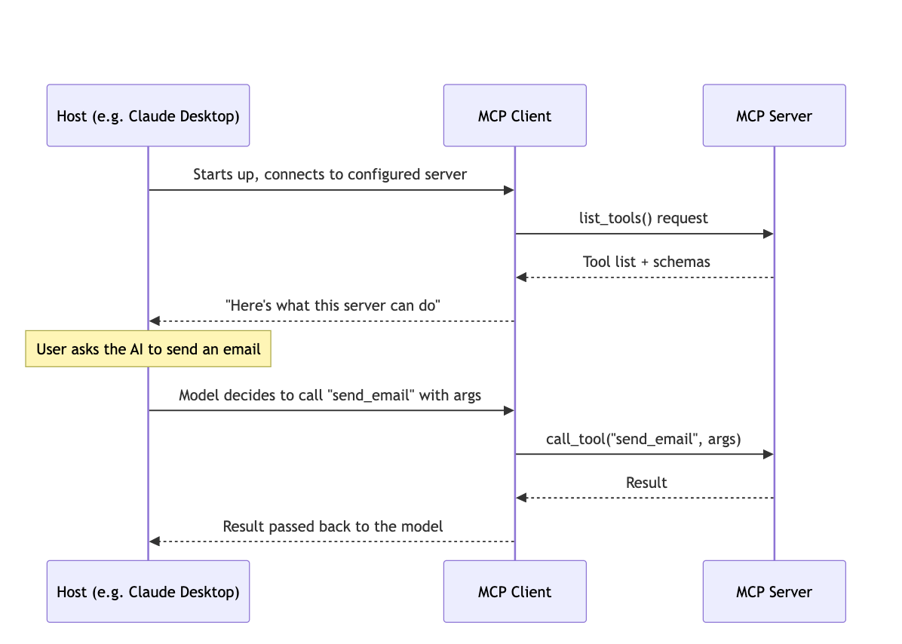
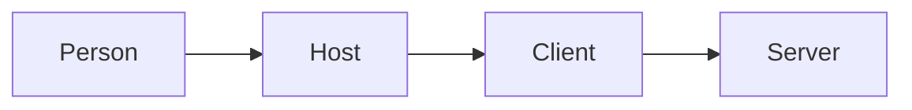
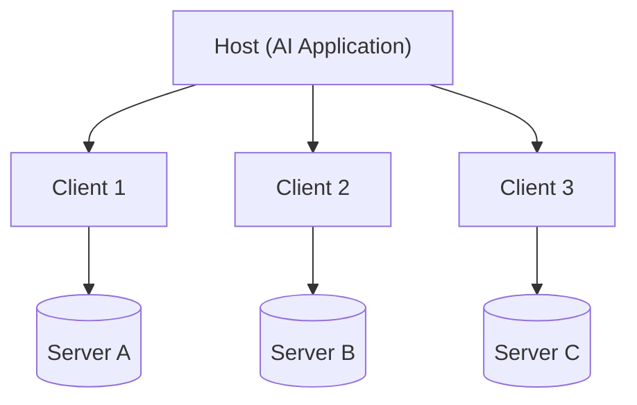

# Krish naik AgenticAI 3.0 Notes

### MCP (Model context protocol)
MCP was developed by anthropic. MCP is an opensource standard for connecting AI applications to external systems. In the begining everyone had to create custom tools that can perform operations they wanted to do example to read email, write email etc. But with MCP, email provider like gmail will provide an MCP server that contains access to all tools, and other required items such as prompt and resources. This helps model to connect as a client to those MCP servers. We can this way connect to any MCP server that we need. 
MCP server is a collection of tools which we access to perform actions. 
In claudeai connectors we see are MCP servers basically provided by different companies. 

With MCP, a developer builds one MCP server for their tool (like GitHub, Google Drive, or a local database), and any AI model that supports MCP can instantly use it.

Advantages of MCP
* Easy to define and access
* scalable - any number of users can connect to mcp
* No redundant code
* Access to all tools and applications - every application will want to create mcp servers to support more user base. 
* Less prone to failure

Negatives of MCP
* complex to set up
* many servers run locally
* less idea about implementation (inside the mcp server is blackbox)

MCP is just a shared toolbox — a standard-shaped collection of tools and APIs that any AI model can reach into, instead of every developer building their own private toolbox from scratch. Tools are what you can order. Resources are the reservation book you're allowed to check. Prompts are the pre-written specials card suggesting what to order - three different kinds of help, from one restaurant.

* Claude desktop, cursor etc is the HOST that runs the MCP client. It knows MCP protocol. 
* MCP Client calls MCP Server over STDIO or Streamable HTTP option. 
* Server calls the real API
* Result flow all the way back to the client 

When the claude desktop starts up it sends initialization message to each connector it is set up to connect to. In MCP world, there is a single host used with multiple clients to connect to multiple connector. 

For example, host is like mobile phone, client is like sim card, and connection to Jio needs one sim card, connection to airtel needs another sim card, but for all of them, they use same host. This is the underlying idea. So claude desktop uses single host to connect to all the connectors. This helps with decoupling individual connections , safety, parallelism and scalability in connections. 

Transport layer: client and server speak JSON-RPC 2.0, not plain REST. Two transport types — STDIO for local servers, Streamable HTTP for remote/hosted servers

**More notes from Mayank**

<a href="https://github.com/mayank953/Live-Class-2026/blob/main/classes_summary/16%20-%2023%20Aug%20-%20MCP%20Introduction.md" target="_blank">MCP-Host-Client-Server</a>

MCP Server contains tools, resources, prompts.
